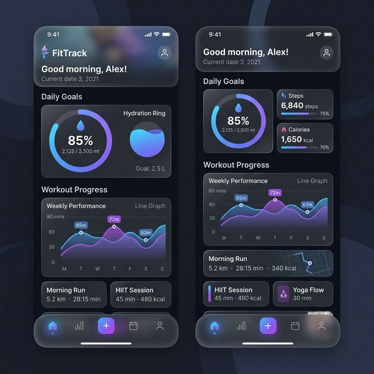

# FitTrack: Social Fitness & Habit Tracker 🚀

A comprehensive, premium health and fitness platform designed to track hydration, workouts, and wellness with real-time Telegram integrations.



## 🌟 Core Features

### 💧 Deep Hydration System
- **Real-Time Logging**: Quick-add water intake with customizable amounts.
- **Smart Editing**: Full control over today's logs (Edit/Delete).
- **30-Day Analytics**: Visualize your hydration trends with dynamic line charts.
- **Telegram Reminders**: Personalized alerts at your preferred frequency (15m to 2h) between 7 AM and 10 PM.
- **Do Not Disturb (DND)**: Set custom quiet hours to pause notifications directly from your profile.

### 🏋️ Advanced Exercise Tracking
- **Catalog Management**: Access a pre-built library of exercises across various categories (Strength, Cardio, Yoga, etc.).
- **Workout Logging**: Track weight, reps, and sets for every session.
- **Progressive Charts**: Monitor your strength gains with history-based charts for every exercise.
- **Rapid Entry**: Streamlined UI for entering data quickly during your workout.

### 🌸 Wellness & Cycle Tracker
- **Smart Predictions**: Track menstrual cycles with backend-driven predictions.
- **Symptom Logging**: Log flow intensity and daily symptoms.
- **History View**: Review past cycles to understand your body better.

### 🤖 Telegram Bot Integration
- **Direct Alerts**: Receive hydration reminders directly on your Telegram account.
- **Easy Setup**: Simply provide your Chat ID (using @userinfobot) and set your preferred interval.
- **Admin Managed**: Secure bot token management via the Admin Dashboard.

---

## 🛠️ Admin Capabilities

### 👥 User Management
- View all registered users and their status.
- Toggle user activity to manage access.
- Monitor overall system engagement.

### 📋 Exercise Catalog Control
- **Manual Entry**: Create and edit exercises with specific body parts and categories.
- **CSV Import/Export**: Bulk manage the exercise library using CSV files for easy catalog updates.
- **Data Integrity**: Ensures consistent naming and categorization across the platform.

---

## 💻 Tech Stack

- **Frontend**: React 18, Vite, Framer Motion (Animations), Lucide React (Icons), Axios.
- **Backend**: Node.js, Express.js, MongoDB (Mongoose), TypeScript.
- **State Management**: React Context API for Authentication and User State.
- **DevOps**: Docker, Docker Compose, Docker Stack for seamless deployment.

---

## 🚀 Getting Started

### Prerequisites
- Docker & Docker Compose
- Node.js (for local development)
- A Telegram Bot Token (from @BotFather)

### Deployment (Docker)
1.  **Clone the Repository**:
    ```bash
    git clone https://github.com/arjunvkrishna/FitTrack-Social-Fitness-Habits.git
    cd FitTrack-Social-Fitness-Habits
    ```
2.  **Environment Setup**:
    Create a `.env` in the root (or use the backend default) with:
    - `MONGODB_URI`
    - `JWT_SECRET`
    - `PORT=5000`
3.  **Run with Docker**:
    ```bash
    docker-compose up -d
    ```
    The app will be available at `http://localhost:3000` (Frontend) and `http://localhost:5000` (Backend).

---

## 📖 Usage Guide

1.  **Initial Setup**: First user to register becomes the **System Admin**.
2.  **Configure Bot**: Admin should go to the Dashboard to enter the **Telegram Bot Token**.
3.  **User Onboarding**: Users can set their **Telegram Chat ID** and **Reminder Frequency** in their Profile.
4.  **Logging**: Start logging hydration and exercises from the Dashboard!

---

## 📝 Version History
- **v3.4.5**: Introduced Do Not Disturb (DND) mode for Telegram reminders.
- **v3.4.4**: Fixed User Profile 401 errors and Telegram Chat ID persistence.
- **v3.4.3**: Resolved Admin Dashboard race conditions and optimized auth headers.
- **v3.4.2**: Refined Telegram reminder scheduling and Profile UI sync.
- **v3.4.0**: Added CSV Exercise Catalog management and Progress Charts.

---
Designed with ❤️ for a healthier lifestyle.
